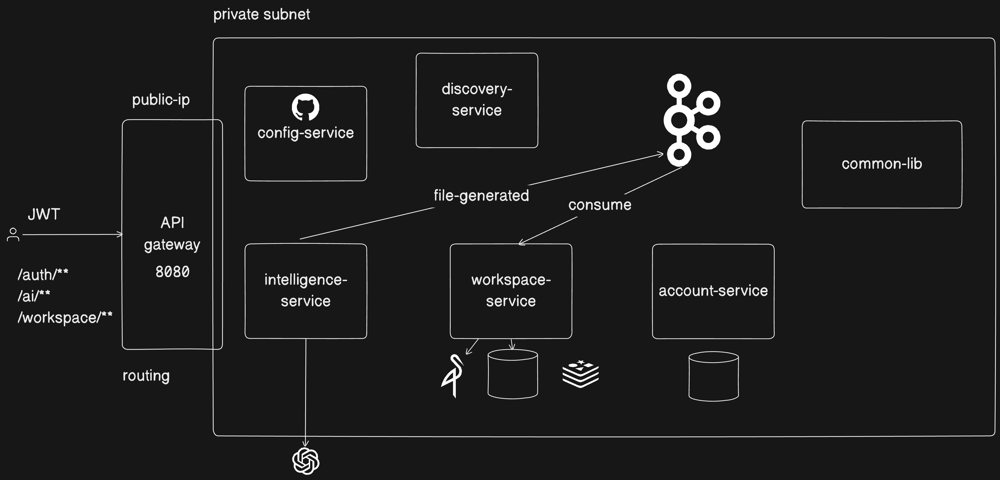
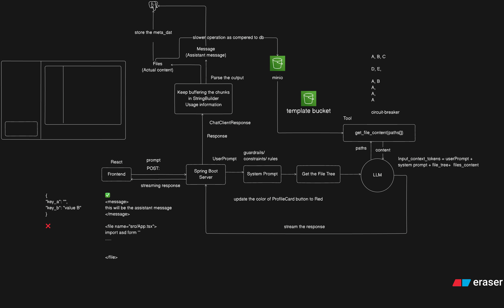
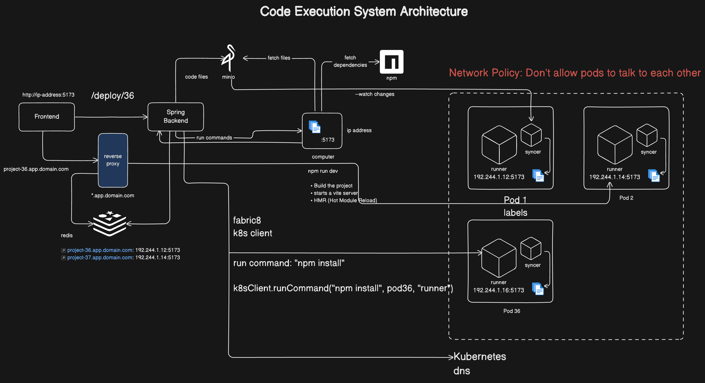
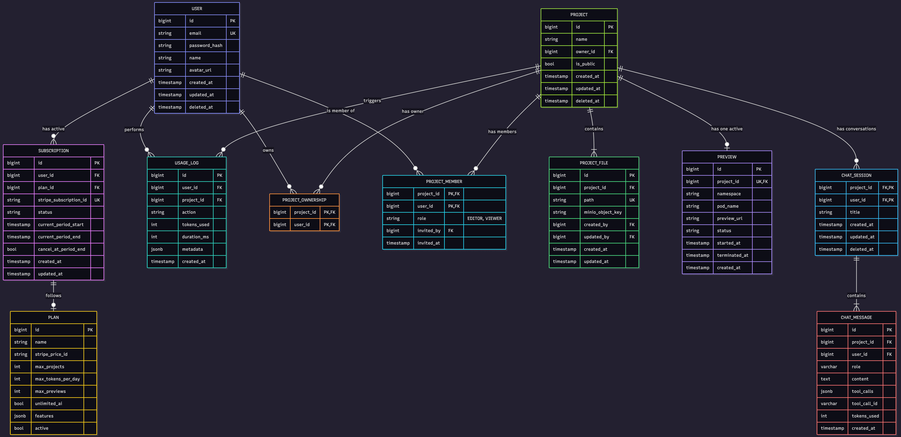
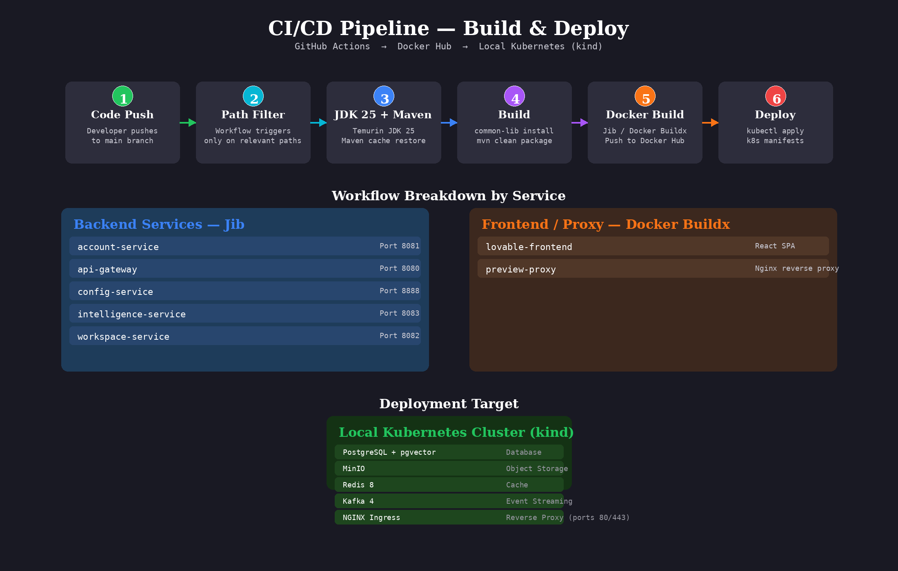

# Lovable — AI-Powered Vibe Coding Platform

[](https://www.oracle.com/java/)
[](https://spring.io/projects/spring-boot)
[](https://reactjs.org/)
[](https://www.typescriptlang.org/)
[](https://kubernetes.io/)
[](https://www.postgresql.org/)
[](#license)

Describe what you want to build in natural language — Lovable generates, deploys, and previews working web applications in real time.

---

## Table of Contents

- [Overview](#overview)
- [Demo](#demo)
- [Architecture](#architecture)
  - [System Architecture](#system-architecture)
  - [Code Generation and Code Execution](#code-generation-and-code-execution)
  - [AI Code Generation Flow](#ai-code-generation-flow)
  - [Code Execution Architecture](#code-execution-architecture)
  - [Database Schema](#database-schema)
  - [CI/CD Pipeline](#ci-cd-pipeline)
- [Key Features](#key-features)
- [Tech Stack](#tech-stack)
- [Microservices Overview](#microservices-overview)
- [API Endpoints](#api-endpoints)
- [Getting Started](#getting-started)
  - [Prerequisites](#prerequisites)
  - [Installation](#installation)
  - [Environment Variables](#environment-variables)
- [Running the Project](#running-the-project)
  - [Local Development](#local-development)
  - [Kubernetes Deployment](#kubernetes-deployment)
- [Project Structure](#project-structure)
- [Contributing](#contributing)
- [License](#license)

---

## Overview

**Lovable** is a full-stack AI-powered application generation platform built as a distributed microservices system. Users describe applications in natural language through an interactive chat interface, and the platform's AI engine generates complete web applications — including HTML, CSS, and JavaScript — that are immediately deployable as live previews on Kubernetes.

The platform supports multi-user collaboration, subscription-based billing via Stripe, token usage tracking, and event-driven file storage. It is designed from the ground up for cloud-native deployment with Kubernetes, service discovery, and CI/CD via GitHub Actions that automatically build and push Docker images to Docker Hub.

### Demo

Link- https://youtu.be/B6HJi5CeOBk

---

## Architecture

### System Architecture

Lovable follows a microservices architecture with six Spring Boot services, a React frontend, and shared infrastructure components.



**Component breakdown:**

| Component | Role |
|---|---|
| **API Gateway** (Port 8080) | Spring Cloud Gateway — single entry point for all client requests. Validates JWT tokens via `GatewayJwtAuthFilter` and routes traffic to downstream microservices. |
| **Account Service** (Port 8081) | User authentication (JWT), registration, login, Stripe billing integration, and subscription management (FREE/PRO plans). |
| **Workspace Service** (Port 8082) | Project CRUD operations, file tree management via MinIO object storage, Kubernetes preview deployments, and multi-user collaboration with role-based access (EDITOR/VIEWER). |
| **Intelligence Service** (Port 8083) | AI chat with Server-Sent Events (SSE) streaming, LLM integration via Spring AI (OpenAI), code generation with file tree context, and chat history persistence. |
| **Config Service** (Port 8888) | Spring Cloud Config Server — Git-backed centralized configuration for all microservices. |
| **Discovery Service** (Port 8761) | Netflix Eureka — service registry enabling dynamic service discovery between microservices. |
| **Common Library** | Shared Maven module containing JWT authentication filter, common DTOs, enums, exception handling, and Feign client interceptor for inter-service communication. |
| **PostgreSQL + pgvector** | Relational database with vector extension, hosting separate schemas per service (account, workspace, intelligence). |
| **MinIO** | S3-compatible object storage for project file trees and generated code artifacts. |
| **Redis** | In-memory cache for preview URL mapping, session data, and rate limiting. |
| **Kafka** | Event-driven messaging for asynchronous file storage operations and inter-service communication. |
| **OpenAI API** | External LLM provider for AI-powered code generation via Spring AI. |

**Data flow:**

1. The React frontend sends requests to the **API Gateway**.
2. The gateway validates the JWT token and routes to the appropriate microservice.
3. Services communicate via **Feign clients** (synchronous) and **Kafka** (asynchronous).
4. All services fetch shared configuration from the **Config Service**, which pulls from a Git repository.
5. Generated files are stored in **MinIO**, preview URLs are cached in **Redis**, and persistent data resides in **PostgreSQL**.

---

## Code Generation and Code Execution

Lovable is architecturally divided into two distinct domains: **Code Generation** and **Code Execution**. These two domains are implemented by separate microservices with clear responsibilities, enabling independent scaling and evolution.

#### Code Generation — Intelligence Service

The **Intelligence Service** (Port 8083) is the brain of the platform. It handles everything related to AI-powered code creation:

- **Natural Language Understanding** — Receives user prompts describing the desired application in plain English.
- **Context Assembly** — Fetches the current file tree, existing file contents, and `package.json` from the Workspace Service via internal Feign clients (`InternalWorkspaceController`). The `package.json` is injected into the LLM context as `PACKAGE_JSON` so the AI knows which third-party packages are already available.
- **System Prompt Construction** — Builds a comprehensive prompt that combines the user's request with the project's current state, ensuring context-aware and incremental code changes. The AI is instructed to only import packages already listed in `package.json`, preventing dependency bloat.
- **LLM Integration** — Sends the assembled prompt to OpenAI's API via Spring AI (`AiGenerationServiceImpl`). The LLM generates complete HTML, CSS, and JavaScript code.
- **Streaming Response** — Returns the AI's response as a real-time stream using Server-Sent Events (SSE), so the user sees code appear character-by-character in the chat interface.
- **Chat History** — Persists every message (user prompts and AI responses) in PostgreSQL for conversation continuity across sessions.
- **Token Tracking** — Logs token consumption per message for usage monitoring and quota enforcement.
- **Auth Header Propagation** — Passes the user's `Authorization` header through to Workspace Service internal calls, ensuring proper permission checks during context assembly.

#### Code Execution — Workspace Service

The **Workspace Service** (Port 8082) is the engine that makes generated code runnable. It handles everything related to project management, file storage, and live preview deployment:

- **Project Management** — Full CRUD for projects, including creation, updates, and soft-deletion.
- **File Tree Management** — Stores and retrieves the hierarchical file structure for each project. Files are stored as objects in MinIO (S3-compatible), with metadata in PostgreSQL (`ProjectFile` entity).
- **Kafka Consumer** — Listens for file storage events published by the Intelligence Service after AI generation. Consumes the event, parses the generated files, and stores them in MinIO.
- **Preview Deployment** — When a user triggers a deployment (`POST /projects/{id}/deploy`), the service uses the Fabric8 Kubernetes Client (`DeploymentService.java`) to create an isolated pod with runner and syncer containers.
- **Runner Pod Lifecycle** — Manages the full lifecycle of preview pods: creation, status monitoring, and cleanup. Each pod serves the generated files via an HTTP server. Supports pod resumption for existing deployments.
- **Pre-baked Runner Image** — Uses a custom Docker image (`saspal02/lovable-runner`) with common npm dependencies (React, Vite, Tailwind, etc.) pre-installed at `/opt/prebake`, significantly reducing preview startup time.
- **Serialized npm Installs** — Uses file-based locking (`/tmp/preview-install.lock`) to prevent concurrent `npm install` operations within a pod, avoiding race conditions when files update rapidly.
- **Preview Status API** — Exposes `GET /projects/{id}/preview-status` endpoint that returns the pod's current status (`CREATING`, `RUNNING`, `FAILED`, `TERMINATED`), enabling the frontend to poll and display real-time preview readiness.
- **Multi-User Collaboration** — Manages project members with role-based access (EDITOR/VIEWER) via the `ProjectMember` entity.


#### How They Work Together

```
User Prompt → Intelligence Service (Code Generation)
                    │
                    ├─ Fetches file tree from Workspace Service
                    ├─ Calls LLM → Streams code back
                    └─ Publishes generated files to Kafka
                           │
Workspace Service (Code Execution) ← Consumes from Kafka
                    │
                    ├─ Stores files in MinIO
                    └─ Deploys preview pod on Kubernetes
```

The Intelligence Service focuses purely on **creating** code, while the Workspace Service focuses purely on **storing and running** it. This separation ensures that:

- AI generation can scale independently of preview deployments.
- File storage and preview infrastructure are centralized in one service.
- Each service has a single, well-defined responsibility following the Single Responsibility Principle.

---

### AI Code Generation Flow

The AI generation pipeline transforms a natural language prompt into deployable code through a multi-step process.



**Step-by-step flow:**

1. **User Prompt** — The user types a description of the desired application in the React frontend chat interface.
2. **Request Routing** — The request travels through the API Gateway to the Intelligence Service (`ChatController.java`).
3. **Context Assembly** — The service fetches the current file tree, existing file contents, and `package.json` from the Workspace Service via internal Feign clients. The `Authorization` header is propagated to ensure proper permission checks.
4. **System Prompt Construction** — The service builds a system prompt that includes:
   - The current file tree structure.
   - Existing file contents for context-aware generation.
   - The project's `package.json` as `PACKAGE_JSON` context, so the AI knows which packages are available.
   - Project-specific constraints and guidelines, including a rule to only import packages already listed in `package.json`.
5. **LLM Call** — The assembled prompt is sent to OpenAI's API via Spring AI (`AiGenerationServiceImpl.java`).
6. **Streaming Response** — The LLM response streams back as SSE events to the frontend in real time.
7. **File Parsing** — The streamed response is parsed to extract code blocks with file paths.
8. **File Storage** — Parsed files are published to Kafka, where the Workspace Service consumes the event and stores them in MinIO.
9. **Preview Deployment** — The Workspace Service triggers a Kubernetes deployment, creating an isolated pod for the updated preview. The frontend polls the preview status endpoint to show real-time readiness.

---

### Code Execution Architecture

Each project's live preview runs in an isolated Kubernetes pod, ensuring complete separation between user projects.



**Architecture details:**

- **Runner Pod** — When a project is deployed (`POST /projects/{id}/deploy`), the Workspace Service creates a dedicated Kubernetes pod containing two containers:
  - **Runner container**: Uses a pre-baked image (`saspal02/lovable-runner:1`) with common npm dependencies (React, Vite, Tailwind, Radix UI, etc.) pre-installed at `/opt/prebake/node_modules`. On startup, it copies these pre-baked dependencies, then runs `npm install` to add any project-specific packages. This reduces cold-start time significantly.
  - **Syncer container**: Uses `pgsty/mc:latest` to fetch the latest files from MinIO via `mc mirror --watch`, keeping the runner's file system synchronized in real time.
  - **Dependency Resolution** — The runner uses file-based locking to serialize `npm install` operations, preventing race conditions. It also watches for `package.json` changes and auto-reinstalls dependencies when new packages are added by the AI.
  - **Reverse Proxy** — A dedicated proxy service (`lovable-me-proxy`) routes incoming preview requests to the correct runner pod based on the subdomain. Returns HTTP 503 with `Retry-After: 10` header when a preview is still starting.
  - **Redis URL Mapping** — The mapping between preview subdomains (`{projectId}.previews.lovable.in`) and pod IPs is stored in Redis for fast lookups.
  - **Resource Limits** — Runner pods are configured with higher CPU limits (up to 2000m) and memory limits (2Gi) to handle npm installs and Vite dev server efficiently.
  - **Network Policies** — Kubernetes network policies isolate preview pods from the core services, ensuring security boundaries.
  - **Preview Status Polling** — The frontend polls `GET /projects/{id}/preview-status` every 5 seconds (up to 10 minutes) to display real-time preview readiness, showing a loading state while the pod starts and notifying the user if the preview terminates.

**Deployment command in code:** `DeploymentService.java` uses the Fabric8 Kubernetes Client to programmatically create and manage preview pods.

---

### Database Schema

The platform uses PostgreSQL with separate schemas per microservice, following database-per-service pattern.



**Entities by service:**

| Service | Entities |
|---|---|
| **Account Service** | `User` — username, email, password hash, role<br>`Subscription` — user reference, plan, status, Stripe customer ID<br>`Plan` — plan name (FREE/PRO), price, token quota<br>`UsageLog` — token count, timestamp, user reference |
| **Workspace Service** | `Project` — title, description, owner ID, creation timestamp<br>`ProjectFile` — path, content reference, project reference, MinIO key<br>`ProjectMember` — user reference, project reference, role (EDITOR/VIEWER)<br>`Preview` — project reference, pod name, URL, status, Kubernetes namespace |
| **Intelligence Service** | `ChatSession` — project reference, creation timestamp<br>`ChatMessage` — session reference, role (user/assistant), content, token count |

The `pgvector` extension is available for potential semantic search and embedding-based features.

---

### CI/CD Pipeline

The project uses GitHub Actions for continuous integration. Each service has a dedicated workflow that automatically builds and pushes Docker images to Docker Hub on every push to the `main` branch.



**Build workflow (per service):**

1. **Code Push** — Developer pushes changes to the `main` branch, triggering the GitHub Actions workflow.
2. **Path Filtering** — Each workflow monitors specific paths (e.g., `account-service/**`, `common-lib/**`) to avoid unnecessary builds.
3. **JDK 25 Setup** — The workflow configures Temurin JDK 25 with Maven caching.
4. **Common Lib Install** — For services depending on `common-lib` (account, workspace, intelligence), it is built and installed to the local Maven repository first.
5. **Service Build** — The target service is packaged with `mvn clean package -DskipTests`.
6. **Docker Image Build & Push** — Backend services use the Jib Maven plugin to build and push images to Docker Hub. The frontend and proxy use Docker Buildx. All images are tagged with the git SHA and `latest`.

**Workflow files:** Seven dedicated workflows exist in `.github/workflows/`, one per deployable component:

| Workflow | Service | Build Tool |
|---|---|---|
| `deploy-account-service.yaml` | Account Service | Jib |
| `deploy-api-gateway.yaml` | API Gateway | Jib |
| `deploy-config-service.yaml` | Config Service | Jib |
| `deploy-frontend.yaml` | Frontend | Docker Buildx |
| `deploy-intelligence-service.yaml` | Intelligence Service | Jib |
| `deploy-proxy.yaml` | Preview Proxy | Docker Buildx |
| `deploy-workspace-service.yaml` | Workspace Service | Jib |

**Deployment to local cluster:** After images are pushed to Docker Hub, deploy them to a local kind cluster using `kubectl apply` with the manifests in `k8s/`. The cluster configuration at `k8s/kind/kind-lovable.yaml` maps host ports 80 and 443 for easy access.

**Additional documentation:**

- 📄 [Feature Overview & API Summary](docs/Lovable_Clone.pdf) — Core features, API endpoints, Stripe payments, quota management, and rate limiting.
- 📄 [Detailed Microservice Architecture Reference](docs/Distributed_Lovable_Architecture.pdf) — Service responsibilities, dependencies, entities, security model, Feign clients, and K8s deployment guide.
- 📄 [Complete API Endpoint Reference](docs/APIs_Lovable_Clone_Project_.pdf) — Full REST API documentation with request/response examples.

---

## Key Features

- **AI-Powered Code Generation** — Natural language to production-ready code with real-time streaming responses via Server-Sent Events.
- **Live Preview Deployments** — Each project gets an isolated Kubernetes pod with a unique subdomain for instant preview. Uses a pre-baked runner image with common npm dependencies for faster cold starts.
- **Multi-User Collaboration** — Invite team members to projects with role-based access control (EDITOR/VIEWER).
- **Stripe Subscription Billing** — Integrated payment processing with FREE (10 projects, 50K tokens) and PRO plans, checkout sessions, and customer portal.
- **Token Usage Tracking** — Per-user token consumption logging with plan-based quota enforcement.
- **File Tree Management** — Hierarchical file storage in MinIO with S3-compatible API, supporting nested directories.
- **Chat History** — Persistent conversation history per project, stored in PostgreSQL.
- **Event-Driven Architecture** — Kafka-based async file storage and inter-service communication.
- **Git-Backed Configuration** — Centralized config management via Spring Cloud Config Server with Git as the source of truth.
- **Automated CI/CD** — GitHub Actions automatically build and push Docker images to Docker Hub on every push to `main`.
- **Service Discovery** — Netflix Eureka for dynamic microservice registration and discovery.
- **JWT-Based Security** — Stateless authentication with shared secret validation across all services.

---

## Tech Stack

### Backend

| Technology | Version | Purpose |
|---|---|---|
| Java | 25 | Runtime language |
| Spring Boot | 4.1.0 | Application framework |
| Spring Cloud | 2025.1.3 | Gateway, Config, Eureka |
| Spring AI | 2.0.1 | LLM integration |
| Spring Security | — | JWT authentication |
| Spring Data JPA | — | Database access |
| Spring Kafka | — | Event-driven messaging |
| MapStruct | 1.6.3 | DTO-entity mapping |
| Lombok | — | Boilerplate reduction |
| Fabric8 Kubernetes Client | — | K8s pod management |
| Stripe Java SDK | 33.4.0 | Payment processing |
| Jib Maven Plugin | 3.5.2 | Docker image builds |

### Frontend

| Technology | Version | Purpose |
|---|---|---|
| React | 18.3.1 | UI framework |
| TypeScript | 5.8.3 | Type safety |
| Vite | 5.4.19 | Build tool |
| Tailwind CSS | 3.4.17 | Utility-first styling |
| Radix UI | — | Accessible component primitives |
| CodeMirror | — | Syntax-highlighted code editor |
| React Router | 6.30.1 | Client-side routing |
| TanStack Query | 5.83.0 | Server state management |
| React Hook Form | 7.61.1 | Form handling |
| Zod | 3.25.76 | Schema validation |
| Vitest | 3.2.4 | Testing framework |

### Infrastructure

| Technology | Version | Purpose |
|---|---|---|
| PostgreSQL | 18 + pgvector | Relational database |
| MinIO | latest | Object storage (S3-compatible) |
| Redis | 8.10 | Caching, preview URL mapping |
| Apache Kafka | 4.0.0 | Event streaming |
| Kubernetes | kind | Container orchestration |
| NGINX Ingress | — | Reverse proxy, SSL termination |

### CI/CD

| Technology | Purpose |
|---|---|
| GitHub Actions | Workflow automation |
| Docker Hub | Container registry |
| Jib | Buildpackless Docker builds (backend services) |
| Docker Buildx | Docker builds (frontend and proxy) |

---

## Microservices Overview

| Service | Port | Database | Key Integrations |
|---|---|---|---|
| **api-gateway** | 8080 | — | Spring Cloud Gateway, JWT validation, route filtering |
| **account-service** | 8081 | `account_db` | JWT, Stripe, PostgreSQL, Eureka |
| **workspace-service** | 8082 | `workspace_db` | MinIO, Kafka, Fabric8 K8s client, Redis, PostgreSQL |
| **intelligence-service** | 8083 | `intelligence_db` | Spring AI (OpenAI), SSE streaming, Kafka, PostgreSQL |
| **config-service** | 8888 | — | Spring Cloud Config, Git backend |
| **discovery-service** | 8761 | — | Netflix Eureka registry |
| **common-lib** | — | — | Shared JWT filter, DTOs, enums, Feign interceptor |

---

## API Endpoints

All public endpoints are accessed through the API Gateway at `api.lovable.in`. Internal endpoints are used for inter-service communication.

### Authentication (Account Service)

| Method | Endpoint | Description |
|---|---|---|
| `POST` | `/auth/signup` | Register a new user account (free tier: 10 projects, 50K tokens) |
| `POST` | `/auth/login` | Authenticate and receive JWT token |

### Billing (Account Service)

| Method | Endpoint | Description |
|---|---|---|
| `GET` | `/api/me/subscription` | Get current user's subscription details |
| `POST` | `/api/payments/checkout` | Create a Stripe checkout session |
| `POST` | `/api/payments/portal` | Open Stripe customer portal |
| `POST` | `/webhooks/payment` | Stripe webhook handler |

### Projects (Workspace Service)

| Method | Endpoint | Description |
|---|---|---|
| `GET` | `/projects` | List all projects for the authenticated user |
| `GET` | `/projects/{id}` | Get project details by ID |
| `POST` | `/projects` | Create a new project |
| `PATCH` | `/projects/{id}` | Update project title/description |
| `DELETE` | `/projects/{id}` | Soft-delete a project |
| `POST` | `/projects/{id}/deploy` | Deploy project to a preview pod (resumes existing pod if found) |
| `GET` | `/projects/{id}/preview-status` | Get current preview deployment status (`CREATING`/`RUNNING`/`FAILED`/`TERMINATED`) |

### Files (Workspace Service)

| Method | Endpoint | Description |
|---|---|---|
| `GET` | `/projects/{projectId}/files` | Get the complete file tree for a project |
| `GET` | `/projects/{projectId}/files/content` | Get content of a specific file (`?path=...`) |

### Collaboration (Workspace Service)

| Method | Endpoint | Description |
|---|---|---|
| `GET` | `/projects/{projectId}/members` | List all members of a project |
| `POST` | `/projects/{projectId}/members` | Invite a new member by email |
| `PATCH` | `/projects/{projectId}/members/{memberId}` | Update a member's role |
| `DELETE` | `/projects/{projectId}/members/{memberId}` | Remove a member from the project |

### Chat & AI (Intelligence Service)

| Method | Endpoint | Description |
|---|---|---|
| `POST` | `/chat/stream` | Stream AI-generated code response (SSE) |
| `GET` | `/chat/projects/{projectId}` | Get chat history for a project |

### Internal Service-to-Service Endpoints

| Method | Endpoint | Service | Description |
|---|---|---|---|
| `GET` | `/internal/v1/users/{id}` | Account | Fetch user by ID |
| `GET` | `/internal/v1/users/by-email` | Account | Fetch user by email |
| `GET` | `/internal/v1/billing/current-plan` | Account | Get current user's subscribed plan |
| `GET` | `/internal/v1/projects/{projectId}/files/tree` | Workspace | Get file tree for AI context (requires Authorization header) |
| `GET` | `/internal/v1/projects/{projectId}/files/content` | Workspace | Get file content for AI context (requires Authorization header) |
| `GET` | `/internal/v1/projects/{projectId}/permissions/check` | Workspace | Check user's permission on a project |

---

## Getting Started

### Prerequisites

- **Java 25** (Temurin recommended)
- **Maven 3.9+** (or use bundled `mvnw`)
- **Node.js 18+** with npm
- **Docker & Docker Compose** — for local infrastructure services
- **kubectl** — for Kubernetes interactions (optional, for local K8s testing)
- **kind** — for local Kubernetes cluster (optional)

### Installation

#### 1. Clone the Repository

```bash
git clone https://github.com/<your-username>/lovable.git
cd lovable
```

#### 2. Configure Environment Variables

Edit the `.env` file in the project root and adjust values for your environment.

#### 3. Start Infrastructure Services

```bash
docker compose up -d
```

This starts PostgreSQL (port 9010), MinIO (ports 9000/9001), Redis (port 6379), and Kafka (port 29092).

#### 4. Install Common Library

```bash
cd common-lib
./mvnw clean install -DskipTests
cd ..
```

#### 5. Start Microservices

Start each service in order (each in a separate terminal):

```bash
# Discovery Service (must start first)
cd discovery-service && ./mvnw spring-boot:run

# Config Service
cd config-service && ./mvnw spring-boot:run

# Account Service
cd account-service && ./mvnw spring-boot:run

# Workspace Service
cd workspace-service && ./mvnw spring-boot:run

# Intelligence Service
cd intelligence-service && ./mvnw spring-boot:run

# API Gateway
cd api-gateway && ./mvnw spring-boot:run
```

#### 6. Start the Frontend

```bash
cd lovable-frontend
npm install
npm run dev
```

The frontend will be available at `http://localhost:5173`.

### Environment Variables

The `.env` file configures all infrastructure and service connections:

| Variable | Description | Example |
|---|---|---|
| `PSQL_USER` | PostgreSQL superuser | `testusr` |
| `PSQL_PASSWORD` | PostgreSQL password | `testpwd` |
| `PSQL_DATABASE` | Default database name | `postgres` |
| `ACCOUNT_DB_PASSWORD` | Account service DB password | `account_db` |
| `WORKSPACE_DB_PASSWORD` | Workspace service DB password | `workspace_db` |
| `INTELLIGENCE_DB_PASSWORD` | Intelligence service DB password | `intelligence_db` |
| `JWT_SECRET` | Shared JWT signing secret | Base64-encoded string |
| `MINIO_ROOT_USER` | MinIO admin username | `miniousr` |
| `MINIO_ROOT_PASSWORD` | MinIO admin password | `miniopwd` |
| `AI_API_KEY` | OpenAI API key | `sk-or-v1-...` |
| `STRIPE_API_KEY` | Stripe secret API key | `sk_test_...` |
| `STRIPE_WEBHOOK_SECRET` | Stripe webhook signing secret | `whsec_...` |
| `GITHUB_URI` | Config server Git repository URL | `https://github.com/...` |
| `GITHUB_USERNAME` | Git repository username | `username` |
| `GITHUB_CONFIG_PASSWORD` | Git repository PAT/token | `github_pat_...` |

Services import their configuration from the Config Service, which pulls from the Git repository specified by `GITHUB_URI`.

---

## Running the Project

### Local Development

**Infrastructure only:**

```bash
docker compose up -d
```

**All services with hot reload:**

Start each microservice with `./mvnw spring-boot:run` in separate terminals. The frontend runs with Vite's dev server for HMR.

**Build for production:**

```bash
# Backend services
cd <service-name> && ./mvnw clean package -DskipTests

# Frontend
cd lovable-frontend && npm run build
```

### Kubernetes Deployment

The project includes complete Kubernetes manifests in the `k8s/` directory for deployment to any K8s cluster (kind, GKE, etc.).

#### 1. Create Namespaces

```bash
kubectl apply -f k8s/infra/namespaces.yaml
```

#### 2. Deploy Core Infrastructure

```bash
# Network policies for core services
kubectl apply -f k8s/infra/core-network-policies.yaml

# Preview network policies
kubectl apply -f k8s/infra/preview-network-policies.yaml
```

#### 3. Deploy Services

```bash
kubectl apply -f k8s/services/discovery-service.yaml
kubectl apply -f k8s/services/config-service.yaml
kubectl apply -f k8s/services/account-service.yaml
kubectl apply -f k8s/services/workspace-service.yaml
kubectl apply -f k8s/services/intelligence-service.yaml
kubectl apply -f k8s/services/api-gateway.yaml
kubectl apply -f k8s/services/frontend.yaml
```

#### 4. Configure Ingress

```bash
kubectl apply -f k8s/infra/ingress.yaml
```

The ingress routes traffic as follows:

| Host | Backend Service |
|---|---|
| `lovable.in` / `www.lovable.in` | Frontend (port 80) |
| `api.lovable.in` | API Gateway (port 80) |
| `*.previews.lovable.in` | Preview proxy (port 80) |

#### 5. Deploy Runner Pool

```bash
kubectl apply -f k8s/infra/runner-pool.yaml
```

#### 6. Verify Deployment

```bash
kubectl get pods -n lovable-core
kubectl get ingress -n lovable-core
```

**CI/CD:** Pushing to `main` automatically triggers the corresponding GitHub Actions workflow, which builds the Docker image with Jib and pushes it to Docker Hub. Each workflow monitors its service's directory path plus `common-lib/**` for dependency changes.

---

## Project Structure

```
lovable/
├── account-service/          # User auth, JWT, Stripe billing, subscriptions
├── api-gateway/              # Spring Cloud Gateway, JWT validation, routing
├── common-lib/               # Shared library: JWT filter, DTOs, enums, exceptions
├── config-service/           # Spring Cloud Config Server (Git-backed)
├── discovery-service/        # Netflix Eureka service registry
├── intelligence-service/     # AI chat, SSE streaming, LLM integration (OpenAI)
├── workspace-service/        # Projects, files (MinIO), K8s previews, collaboration
├── lovable-frontend/         # React 18 + TypeScript + Vite + Tailwind CSS
├── k8s/                      # Kubernetes manifests
│   ├── infra/                # Namespaces, ingress, network policies, runner pool
│   ├── services/             # Deployment manifests for each microservice
│   ├── proxy/                # Preview reverse proxy configuration
│   ├── runner/               # Runner pod templates
│   ├── stateful/             # StatefulSet definitions
│   └── kind/                 # Kind cluster configuration
├── docs/                     # Architecture diagrams, PDFs, and demo video
├── .github/workflows/        # GitHub Actions CI/CD workflows
├── docker-compose.yml        # Local infrastructure (PostgreSQL, MinIO, Redis, Kafka)
└── .env                      # Environment variables
```

---
